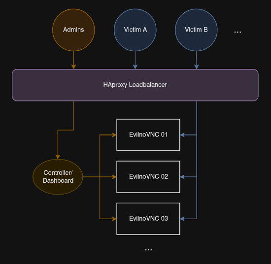

# EvilKnievelnoVNC

Weaponized EvilnoVNC: scalable and semi-automated MFA-Phishing via "browser-in-the-middle"

## Features

* concurrent [EvilnoVNC](https://github.com/JoelGMSec/EvilnoVNC) instances, as many as your server can handle
* access to EvilnoVNC sessions is limited to generated URLs with random victim-specific identifier in parameter
* auto block users after successful authentication, presenting an arbitrary message/page
* manipulate target site via Chromium extension, e.g. hide alternative login methods such as hardware token, or perform any action in the name of the victim
* admin dashboard
    * monitor active victims in real-time
    * react on victim's actions: view session, overtake (authenticated) session or reset session
    * overview of phishing campaign progress
    * collected credentials
* dynamic resolution mode with preloading page is currently the default
* victims can paste text to noVNC via dirty trick
* a victim's user agent is replicated

## Technical Overview

* Running on multiple Docker containers with internal networking
* HAproxy used as loadbalancer and gatekeeper
* nginx for simple dashboard
* victim data and statistics is stored in a central targets.json
* Chromium extension inside noVNC that monitors the victim's activity

## Setup

* clone repo to server
    * server should be reachable via a phishing domain with valid TLS certificate
    * docker, bash and realpath required as basic dependencies, screen/byobu/lazydocker is recommended
* customize variables in setup.sh
    * maximum amount of instances (>=300 MB of RAM per active session)
    * phishing domain, admin pw, etc.
* run setup.sh from its directory (`./setup.sh`)
* blocking users on successful login requires at least one defined search string (EvilnoVNC/Files/content.js)
* after setup, run EvilKnievelnoVNC
   * run centrally with `./run.sh` (BETA state)
   *  or run each container manually with its `./run.sh` script in controller/, haproxy/, EvilnoVNC/
   * for a reset stop all containers and run `./setup.sh clean`, removes all generated and collected data
* consider adapting error messages to impede suspision (haproxy/503.http), e.g. in the design of the target site
* consider customizing the preloading page to fit to the target site (EvilnoVNC/Files/index.php)
* consider customizing the error page when users get bocked (EvilnoVNC/Files/vnc_light.html)
* consider adjusting timezone info in config files (grep), the default is Europe/Berlin

## Usage

* when running EvilKnievelnoVNC the admin dashboard is reachable via the defined URL and basic auth credentials
* by default a self-signed TLS certificate will be presented (CN: testing-server) with the following fingerprints
    * sha1 `AE:28:1B:05:5B:C0:55:41:22:DA:7C:6F:D2:51:8D:D1:11:B2:7C:21`
    * sha256 `D0:B6:9D:86:6D:AE:B4:E1:CA:F0:C1:F5:4D:82:45:7E:13:06:CD:1A:DE:49:A3:80:DC:21:6A:5C:A8:F4:84:1B`
* configure victims in the dashboard via "Manage Targets"
    * add an email address per victim
* send the generated URLs to the victims and monitor the activity in the dashboard
* caution
    * use responsibly and only in legal manners
    * there is no guarantee for anything, check the code and test it before usage

## Advanced Usage

* victim actions are logged to accesslog.txt and submitlog.txt
* place your own TLS certificate, define location in setup.sh
* consider running controller and haproxy manually with their respective run.sh for debugging and insights
    * there needs to be at least another container running before haproxy is started! (haproxy limitation)
* consider customizing the name of the identifier URL parameter (haproxy/haproxy.cfg and controller/src/*/*.php)
    * with some adjustments, it can be placed in the path of the URL as well

## To Do List

* stress test implementation for lots of concurrent activity (feedback is welcome)
* block user if a specific (session) cookie pops up (halfway implemented, see EvilnoVNC/Files/content.js)
* test newest features of EvilnoVNC not yet implemented in EvilKnievelnoVNC
* add Squid proxy for accessing target sites over same IP when Chromium profile has been copied to admin
* avoid pre-loading page for getting victim's resolution
* real dynamic resolution: adapt noVNC canvas when victim changes their window size
* rebuild modern admin dashboard

## See Also

* [MultiEvilnoVNC](https://github.com/wanetty/MultiEvilnoVNC)
* [CuddlePhish](https://github.com/fkasler/cuddlephish) using WebRTC

